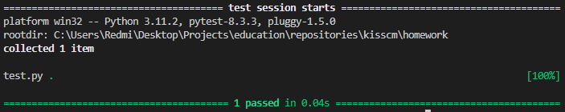

# [Задание №3](https://github.com/Czertilla/kisscm/tree/hw3 "репозиторий с кодом")

## Постановка задачи

Разработать инструмент командной строки для учебного конфигурационного языка, синтаксис которого приведен далее. Этот инструмент преобразует текст из входного формата в выходной. Синтаксические ошибки выявляются с выдачей сообщений.

Входной текст на **учебном конфигурационном языке** принимается из стандартного ввода. Выходной текст на языке json попадает в файл, путь к которому задан ключом командной строки.

### Словари

```
 @{
   имя = значение;
   имя = значение;
   имя = значение;
   ...
}
```

### Имена

Допускаются строки любой длины, соотвевующих регулярному выражению `[A-Z]+`

### Значения

- Числа.
- Строки.
- Словари.

### Строки:

`'Это строка'`

### Объявление константы

Константы объявляются на этапе трансляции

```
let имя = значение;
```

### Вычисление константного выражения

Константые выражения вычисляются на этапе трансляции. Используется префиксная
форма

```
$+ имя 1$
```

Результатом вычисления константного выражения является значение.
Для константных вычислений определены операции и функции:

1. Сложение.
2. Вычитание.
3. Умножение.
4. ord().

Все конструкции учебного конфигурационного языка (с учетом их возможной вложенности) должны быть покрыты тестами. Необходимо показать 3 примера описания конфигураций из разных предметных областей.

## Использование

1. Распакуйте или клонируйте репозиторий в рабочую папку
2. Установите все необходимые зависимости

```
pip install -r requirements.txt
```

3. запустите программу

```
py main.py result.json
```

или

```
python.exe main.py result.json
```

4. вводите текст на **учебном конфигурационном языке** в соответсвии с `Постановкой задачи`

## Тестирование


